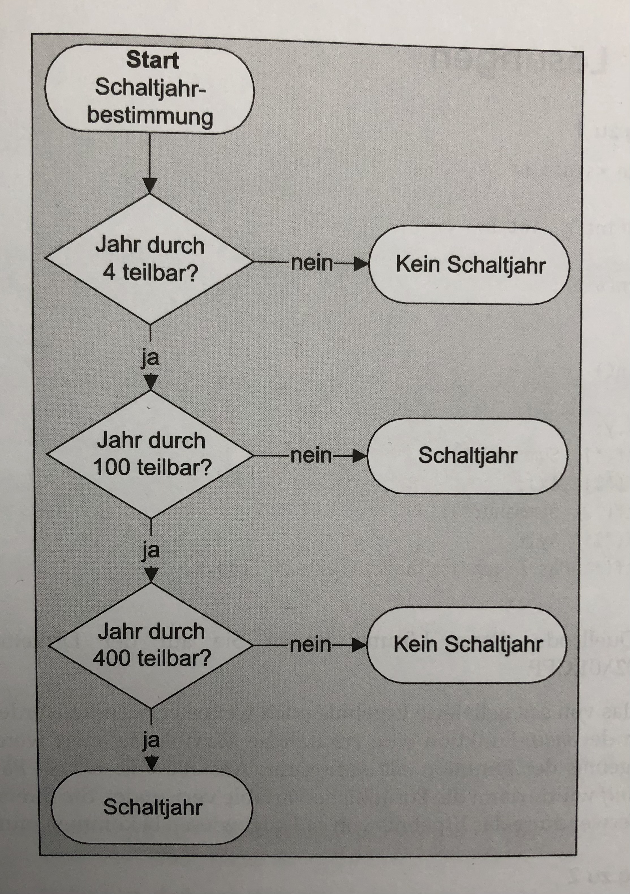

### Aufgabe 1:

Berechnen Sie das Maximum dreier ganzer Zahlen.

### Aufgabe 2:

Entscheiden Sie, ob eine Jahrzahl für ein Schaltjahr steht oder nicht?

Verwenden Sie dabei die Hilfestellung des folgenden Bilds:

*Abbildung* 1: Bestimmung eines Schaltjahrs.
